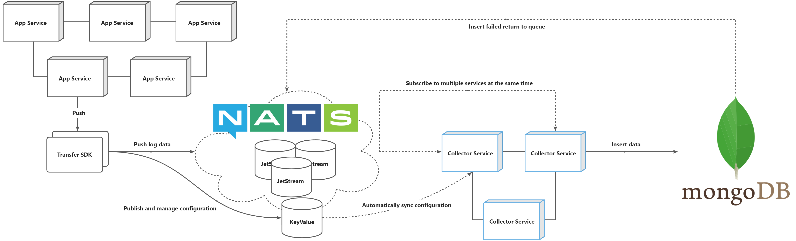

# Transfer & Collector

## Pre-requisites

* A Nats cluster with JetStream enabled.
* A MongoDB, preferably with a version greater than 5.0, so that time series collections can be used.
* Services can only work together under the same namespace.

> The same namespace defines the database name for mongodb, `${namespace}_logs` for nats key-value, `${namespace}:logs:${key}` for nats stream

## Collector

The collector service for subscribing to the stream queue and then writing to the log collection.

<figure><figcaption></figcaption></figure>

The collection needs to be managed manually and created with the name `${key}_logs`.

> If the mongodb version is greater than 5.0, recommended time series collection, the transfer contains `metadata` field will be set to the time series collection metaField.

The main container images are:

* ghcr.io/weplanx/collector:latest
* ccr.ccs.tencentyun.com/weplanx/collector:latest

The case will deploy the orchestration using Kubernetes, replicating the deployment (with modifications as needed).

```yaml
apiVersion: apps/v1
kind: Deployment
metadata:
  name: collector
spec:
  replicas: 3
  selector:
    matchLabels:
      app: collector
  template:
    metadata:
      labels:
        app: collector
    spec:
      containers:
        - image: ccr.ccs.tencentyun.com/weplanx/collector:v1.7.0
          imagePullPolicy: Always
          name: collector
          env:
            - name: MODE
              value: release
            - name: NATS_HOSTS
              value: <*** your nats hosts ***>
            - name: NATS_NKEY
              value: <*** your nats nkey***>
            - name: DATABASE
              value: <*** your mongodb uri ***>
            - name: NAMESPACE
              value: example
```

The environment variable of the service.

| Parameter    | Description                                   |
| ------------ | --------------------------------------------- |
| `MODE`       | Log level is production when set to `release` |
| `NAMESPACE`  | Namespace for collector and transfer          |
| `NATS_HOSTS` | Nats connection address                       |
| `DATABASE`   | MongoDB uri                                   |
